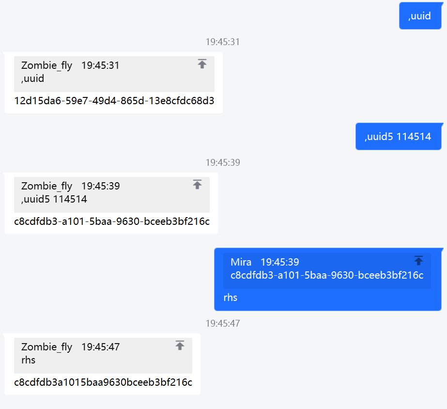

# nonebot-plugin-uuid

_✨ UUID 生成器 ✨_

## 📖 介绍

通过 uuid4 与 uuid5 生成 uuid ，并且支持快速去除短横线

## 💿 安装

使用 nb-cli 安装

在 nonebot2 项目的根目录下打开命令行, 输入以下指令即可安装

    nb plugin install nonebot-plugin-uuid

使用包管理器安装

在 nonebot2 项目的插件目录下, 打开命令行, 根据你使用的包管理器, 输入相应的安装命令

pip

    pip install nonebot-plugin-uuid

pdm

    pdm add nonebot-plugin-uuid

poetry

    poetry add nonebot-plugin-uuid

conda

    conda install nonebot-plugin-uuid

打开 nonebot2 项目的 `bot.py` 文件, 在其中写入

    nonebot.load_plugin('nonebot_plugin_uuid')

## ⚙️ 配置

本插件无需配置

## 🎉 使用

### 指令表

|     指令     |  权限  | 需要@ | 范围  |                                              说明                                              |
| :----------: | :----: | :---: | :---: | :--------------------------------------------------------------------------------------------: |
|     uuid     | 任何人 |  否   | 全局  |                                 使用 `uuid4` 生成一个标准 uuid                                 |
| uuid5 `种子` | 任何人 |  否   | 全局  |                       使用传入的 `种子` ，通过 `uuid5` 生成一个标准 uuid                       |
|     rhs      | 任何人 |  否   | 全局  | 使用该命令回复一条消息，解析消息中的 uuid ，返回不带连字符的uuid（**R**emove **h**yphen**s**） |

### 效果图

